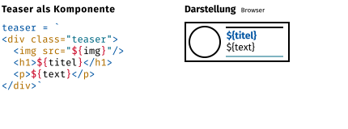
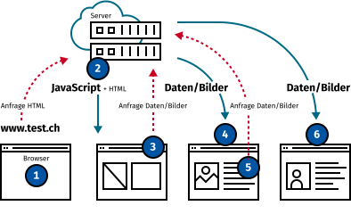

## Publisher 3 · 2019
Erscheinungsdatum · 24. 6. 2019

## Lizenzen
Dieser Text ist von Stefan Huber unter der Lizenz [CC-BY-SA 4.0](https://creativecommons.org/licenses/by-sa/4.0/) veröffentlicht. [Publisher](https://publisher.ch/) erhält das Recht die Inhalte ohne Copyleft (Share Alike) zu publizieren.

[CMYK Bilder für Print (pdf)](./frontend-frameworks_graphics_cmyk.pdf)

# Front-End Frameworks – Websites heute

<lead>

Bei der Interaktion mit einer Website erwarten User eine flüssige Reaktion des Interface. Seit einigen Jahren sind sogenannte «Front-End Frameworks» im Web stark verbreitet, sodass der Browser die Darstellung ab dem ersten Laden selber übernehmen kann, was ab da zu einem besseren Nutzungserlebnis führt.

</lead>

## Websites – gestern
Einhergehend mit der Entwicklung seines Hypertext-Formates HTML, schuf Tim Berners-Lee ab 1989 am CERN in Genf den ersten Webbrowser (gleichzeitig auch Web-Editor) mit dem Namen WorldWideWeb (später Nexus). Der Browser konnte zwar schon Sprungmarken (Links) und somit Informationen verknüpfen, jedoch lag der Fokus primär auf der Vermittlung und dem Zugänglichmachen von Information. Die heute sogenannte «User Experience» (UX) war primär über den Inhalt und weder über die Gestaltung noch über die Interaktion bestimmt.

## HTML als Container für Inhalt

Bei der genaueren Untersuchung einer reduzierten HTML-Seite ist schnell zu erkennen, dass der Inhalt nur einen Teil der Seite ausmacht und die innere Struktur der Seite (Semantik) mindestens genauso wichtig ist. Zusammen mit dem Styling über CSS (Cascading Style Sheets) wird dann die Darstellung errechnet.

Ausgeliefert wird klassisch jedoch nicht geteilt nach Daten und Struktur, sondern in einer Kombination. Die HTML-Datei enthält Semantik und Inhalt.
Die Inhalte sind traditionell in einer Datenbank von der Redaktion abgespeichert worden und der Server fügt in die entsprechende Stelle im HTML diese Inhalte ein.

Das Beispiel zeigt im Wesentlichen folgende Strukturen:

* Seitenstruktur (`<html/> <body/>`)
* Zwei Teaser (`
`)
* ein Titel (`<h1/>`) je Tease
* ein Text (`
`) je Teaser
* ein Bild (``) je Teaser

## Vom Server bis zum Browser
Technisch ist das Abrufen von HTML-Websites in wenige Schritte gegliedert und auch heute werden noch viele Seiten meist wie folgt aufgebaut.

1. User erfragt die Seite vom Server über eine URL oder einen Link.
2. Server liefert HTML-Seite.
3. Browser erfragt weitere Ressourcen wie Bilder, Stylesheets (CSS) usw.
4. Website wird fertig dargestellt (Rendering).
5. Bei einem Klick auf einen Link geht der Prozess mit der neuen Seite von Neuem los.

## Websites – heute
Da das zeitaufwendige Laden der ganzen Website nach jedem Klick keine ideale User Experience erlaubt, werden heute Semantik und Daten gerne auseinandergenommen. Die «Templates» (Semantik) für die Komponenten beinhalten auch das Styling und werden nur einmal vom Server übertragen. Wird dieselbe Komponente später noch einmal benutzt, so werden nur die Daten ausgetauscht. Dies kann der Browser mithilfe eines sogenannten «Front-End Framework» selbstständig tun und beim Server müssen nur die Inhalte erfragt werden. Das spart Daten und es kann sehr schnell auf Eingaben des Benutzers reagiert werden. Auch das Konzept von «Seiten» ist aufgelöst. Eine neue Seite ist in so einem Framework nur noch eine Komponente, die mit anderen Inhalten gefüllt wird. Auch wenn der Benutzer glaubt, auf eine andere URL zu wechseln, so tauscht der Browser lediglich die Inhalte aus und das Grundgerüst der Website bleibt erhalten.

Vereinfacht könnte eine Komponente einer Seite so aussehen:

Innerhalb dieser Seite wird dann die Teaser-Komponente mehrfach verwendet:

Um nun die vollständige Seite darzustellen (Rendering), müssen nur noch die Daten in die jeweiligen Komponenten eingefüllt werden.

## Vom Server zur Komponente
Heutige Verfahren haben insbesondere dann grosse Vorteile, wenn mehrere Seiten besucht werden, bei denen in den Folgeseiten nur noch die Daten und nicht mehr die Templates geladen werden müssen.

1. User erfragt die Seite vom Server über eine URL oder einen Link.
2. Server liefert JavaScript, eingebunden in einer HTML-Seite.
3. Browser erfragt Daten und Bilder.
4. Website wird fertig dargestellt (Rendering).
5. Bei einem Klick auf einen Link werden nur noch Daten und Bilder angefragt.
6. Die Darstellung wird neu im Browser gerechnet. Es müssen nur noch die neuen Daten erfragt werden, nicht aber die Semantik, da die Komponenten-Templates bereits geladen sind.

## Ausblick
Seit etwa 2010 sind die ersten Front-End Frameworks ([Backbone](https://backbonejs.org/) Framework) auf grossen Websites im Einsatz. Firmen wie Google ([Angular](https://angular.io/) Framework) oder Facebook ([React](https://reactjs.org/) Framework) haben ihre Produkte bereits grossflächig auf diese neuen Technologien umgestellt. Aber auch lokale Portale wie zum Beispiel [werbewoche.ch](https://www.werbewoche.ch/) nutzen die Technologie aktiv. Da diese Frameworks von immer mehr Web-Entwicklern erlernt werden und die bessere User Experience vermehrt von Kunden erfragt wird, darf man sich auch in Zukunft auf noch interaktivere und responsivere Seiten freuen.

### Autor
Stefan Huber unterrichtet an der [Schule für Gestaltung Zürich](https://sfgz.ch/) im Lehrgang HF Interaction Design und ist als Web-Entwickler tätig.

