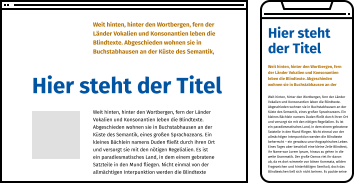

## Publisher 4 · 2019
Erscheinungsdatum · 2. 9. 2019

## Lizenzen
Dieser Text ist von Stefan Huber unter der Lizenz [CC-BY-SA 4.0](https://creativecommons.org/licenses/by-sa/4.0/) veröffentlicht. [Publisher](https://publisher.ch/) erhält das Recht die Inhalte ohne Copyleft (Share Alike) zu publizieren.

# Design-Systeme im Web

> Während beim Grafik-Design auf physischen Meiden die gestaltende Person meist den zu kommunizierenden Inhalt, wie auch die Dimension des Ausgabemendiums kennt, ist bei der Arbeit mit modernen Websites bei der Entwicklung nur eine Idee des später entstehenden Inhalts vorhanden und die Ausgabebedingungen werden durch die Geräte bei den Endkunden stets neu defineirt. Das Layout hat sich entsprechend zu Fügen. Eine Herausforderung!

## Gestaltung war früher

In einem traditionellen Design-Verständnis hat ein Kunde einen Inhalt, den er mittels einer geeigneten Form zum Endpublikum transportieren möchte. Da der Vorgang der Gestaltung mit der Information über Inhalt (Manuskript, Bilder, ...) wie auch über das Ausgabemedium (Buch, Inserat, ...) statt findet, kann eine fertige Gestaltung gemacht werden und es gibt nach dem «Gut zum Druck» keine Varianz und keine Unsicherheit mehr, was mit dem Inhalt oder aber mit dem Medium noch geschehen könnte. Die Gestaltung und die Botschaft sind festgelegt.

## Systeme für ein lebendiges Medium

In der Gestaltung im Web-Umfeld sind Inhalte oftmals nicht abgeschlossen oder entstehen erst. Die Website dient als ein Kommunikationskanal, welcher vielfältig eingesetzt wird und der oftmals einem Bedürfnis und nicht einem konkreten Plan folgt. Spätestens seit Marshall McLuhans bekanntem Zitat «The medium is the message» ist klar, dass das Medium nicht nur Nachricht zu transportieren hat, sondern diese auch wesentlich formt, beeinflusst oder gar ersetzt. Somit muss die Gestaltung ein System oder ein Regelsatz erarbeiten, welches dann später mit «Inhalten» angereichert wird. Es geht nicht darum genau für einen Inhalt oder für ein Bedürfnis zu gestalten, sondern es muss eine Idee oder ein Konzept unterstützt werden, welches später erst durch den «Inhalt» leben erhält.

## Templates – wie langweilig

*Die Auswahl von Templates ist endlich und meist sehr einschränkend.*

Bei einfachen Templates für Websites oder bei Website-Generatoren gibt es oftmals nur ein paar wenige «Grundlayouts», die man dann mit Inhaltstypen abfüllen kann. Oftmals kommt sogar lediglich ein Template für die Startseite und ein Template für den «Inhalt» zur Anwendung. Die Kommunikation muss also zwangsläufig dem Template angepasst werden oder noch schlimmer; der Inhalt passt gar nicht erst in die Templatestruktur. «Das geht nicht» oder «Unser CMS kann das nicht» kommt von der Web-Redaktion als Rückmeldung auf einen inhaltlichen Wunsch. Doch die Technik soll inspirieren und nicht Denkbarrieren schaffen.

## Module und Komponenten

*Bei Modulen/Komponenten kommen immer wieder die selben Grundbausteine in einem fix definierten Regelwerk vor. Jedoch ist die Vielfalt durch ein flexibles Zusammenwirken stets gegebenen.*

Bei modernen Design-Systemen werden oftmals nicht mehr traditionelle Templates zur Erstellung von Seiten gebraucht, sondern Module und Komponenten dienen als Baublöcke zum Erstellen der Seite. So kann sich die Struktur dem Inhalt anpassen und diesen auch unterstützen und formen. Die Gestaltung definiert nun die Regeln für die Komponenten, macht das Aussehen und den Raster stimmig. Unabhängig davon wie später der Inhalt abgefüllt wird, muss das Design-System funktionieren und die einzelnen Strukturen müssen zusammenpassen. Ein einheitliches Gestaltungsbild auf allen Systemen und auf den diversen Endgeräten muss stets im Auge behalten werden.

## Typografie und Breakpoints
Da die Gestaltung nicht mehr an ein fest definiertes Ausgabemedium gebunden ist, muss auch hier ein Design-System dafür sorgen, dass über alle Viewports (Bildschirmgrösse) hinweg eine optimale Typografie gewährt ist. Dies lässt sich oftmals nicht durch eine Simple Definitionen für Mobile und Desktop abspeisen. Es müssen Breakpoints gefunden werden, wo es sinnvoll ist, das Layout umzustellen. Zudem muss die Typografie sich über alle möglichen Viewports anpassen. Tests an der «lebendigen» Website sind zwingend notwendig und können nicht durch simple Entwürfe in einem Layout-Program simuliert werden. Grössen und Design muss liquid und responsiv funktionieren.

*Wurde ein Design zu sehr mit den Prinzipien eines breiten Viewports (Desktop) konzipiert, so wirkt der Grundtext auf mobilen Geräten zu klein und die Titelabstufung scheint übertrieben.*

*Wurde das Design zu sehr mit den Prinzipien eines kleinen Viewports (Mobile) gestaltet, so wirkt die Gestaltung auf Desktop-Geräten zu kontrastarm und der Grunddtext wirkt zu gross.*

## Fazit
Die Gestaltung von Websites hat viele Variablen und soll mittels einem Regelsatz die Redaktion von Design-Entscheidungen entlasten. Die Spezialisten für den Inhalt sollen sich diesem voll und ganz hingeben können und die Spezialistinnen für die Gestaltung sollen ein Regelsystem und eine Gestaltung aufbauen, die dem Inhalt und den diversen Ausgabegeräten gerecht wird.

### Autor
Stefan Huber unterrichtet an der [Schule für Gestaltung Zürich](https://sfgz.ch/) im Lehrgang HF Interaction Design und ist als Web-Entwickler tätig.

